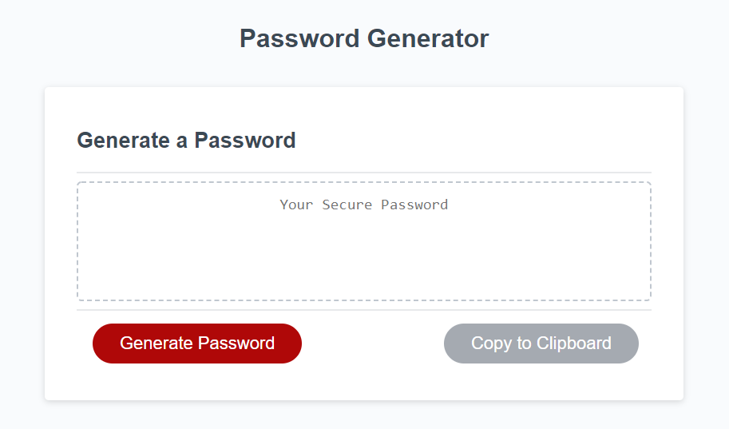
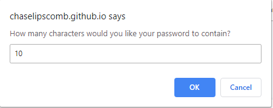

# Password Generator

The Password Generator is a small application that generates a password based on a variety of factors. The user will be prompted to answer questions relevant to the creation of the password. The password will then be displayed and can be copied to clipboard. 

## Built With

* JavaScript
* HTML/CSS

## Pages

### Front Page

The homepage displays a single page.

### Prompts

The user will be prompted by a series of questions prior to the creation of the password.

https://chaselipscomb.github.io/Password/